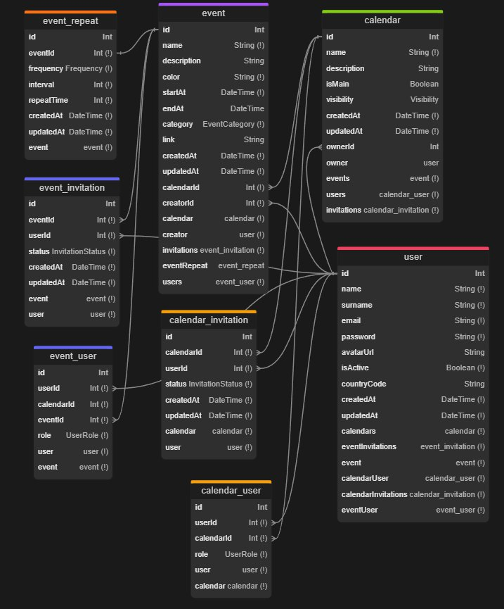

<p align="center">
  
</p>
<p align="center">
    <h1 align="center">Chronos</h1>
</p>
<p align="center">
    <em>Calendar application Nest API</em>
</p>
<p align="center">
 
 
 
 
<p>
<p align="center">
  <em>Developed with the software and tools below.</em>
</p>
<p align="center">
 
 
 
 
    
    
    
    
    
    
    
    
    
    
    

</p>
<hr>

## 🔗 Quick Links

> - [📋 Overview](#-overview)
> - [🚀 Tech Stack](#-tech-stack)
> - [🗄️ Database Schema](#️-database-schema)
> - [💻 Getting Started](#-getting-started)
>     - [⚙️ Installation](#️-installation)
>     - [🕜 Running Chronos](#-running-chronos)
> - [📜 Swagger Documentation](#-swagger-documentation)
> - [🤝 Contributing](#-contributing)
> - [📄 License](#-license)

---

## 📋 Overview

Chronos is a robust calendar management system API built with Nest.js and TypeScript. It provides comprehensive functionality for managing calendars, events, invitations, and user interactions in a scalable and secure manner.

---

## 🚀 Tech Stack

- **Core**: [TypeScript](https://www.typescriptlang.org/), [Nest.js](https://nestjs.com/)
- **Database**: [PostgreSQL](https://www.postgresql.org/), [Prisma ORM](https://www.prisma.io/)
- **Caching**: [Redis](https://redis.io/)
- **Authentication**: [JWT](https://jwt.io/), [bcryptjs](https://www.npmjs.com/package/bcryptjs)
- **Storage**: [AWS S3](https://aws.amazon.com/s3/)
- **Email**: [React-email](https://react.email/), [Nodemailer](https://nodemailer.com/)
- **Validation**: [class-validator](https://github.com/typestack/class-validator), [class-transformer](https://github.com/typestack/class-transformer), [zod](https://zod.dev/)
- **HTTP Client**: [axios](https://axios-http.com/)
- **Security**: [helmet](https://helmetjs.github.io/)
- **Documentation**: [Swagger](https://swagger.io/)
- **Development**: [ESLint](https://eslint.org/), [Prettier](https://prettier.io/), [Husky](https://typicode.github.io/husky/)
- **Containerization**: [Docker](https://www.docker.com/)

---

## 🗄️ Database Schema

The database schema is defined using Prisma. Below is a visual representation of the schema:

<p align="center">
    
</p>

---

## 💻 Getting Started

### ⚙️ Installation

1. Clone the Chronos repository:

```sh
git clone https://github.com/maxkrv/chronos-be.git
```

2. Change to the project directory:

```sh
cd chronos-be
```

3. Install the dependencies:

```sh
npm install
```

4. Create a `.env` file in the root directory and add environment variables like in `.env.example` file.

### 🕜 Running Chronos

Use the following command to run the Chronos application:

```sh
npm run dev
```

---

## 📜 Swagger Documentation

To view the Swagger documentation for the Chronos API, follow these steps:

1. Ensure the Chronos application is running.
2. Open your web browser and navigate to `http://localhost:6969/api/docs#/`.

This will open the Swagger UI, where you can explore and test the API endpoints interactively.

--

---

## 🤝 Contributing

Contributions are welcome! Here are several ways you can contribute:

- **[Submit Pull Requests](https://github.com/maxkrv/chronos-be/blob/main/CONTRIBUTING.md)**: Review open PRs, and submit your own PRs.
- **[Join the Discussions](https://github.com/maxkrv/chronos-be/discussions)**: Share your insights, provide feedback, or ask questions.
- **[Report Issues](https://github.com/maxkrv/chronos-be/issues)**: Submit bugs found or log feature requests for Chronos-be.

<details closed>
    <summary>Contributing Guidelines</summary>

1. **Fork the Repository**: Start by forking the project repository to your GitHub account.
2. **Clone Locally**: Clone the forked repository to your local machine using a Git client.

    ```sh
    git clone https://github.com/maxkrv/chronos-be
    ```

3. **Create a New Branch**: Always work on a new branch, giving it a descriptive name.

    ```sh
    git checkout -b new-feature-x
    ```

4. **Make Your Changes**: Develop and test your changes locally.
5. **Commit Your Changes**: Commit with a clear message describing your updates.

    ```sh
    git commit -m 'Implemented new feature x.'
    ```

6. **Push to GitHub**: Push the changes to your forked repository.

    ```sh
    git push origin new-feature-x
    ```

7. **Submit a Pull Request**: Create a PR against the original project repository. Clearly describe the changes and their motivations.

Once your PR is reviewed and approved, it will be merged into the main branch.

</details>

---

## 📄 License

This project is licensed under the MIT License - see the [LICENSE](https://github.com/maxkrv/chronos-be/blob/develop/LICENSE) file for details.
